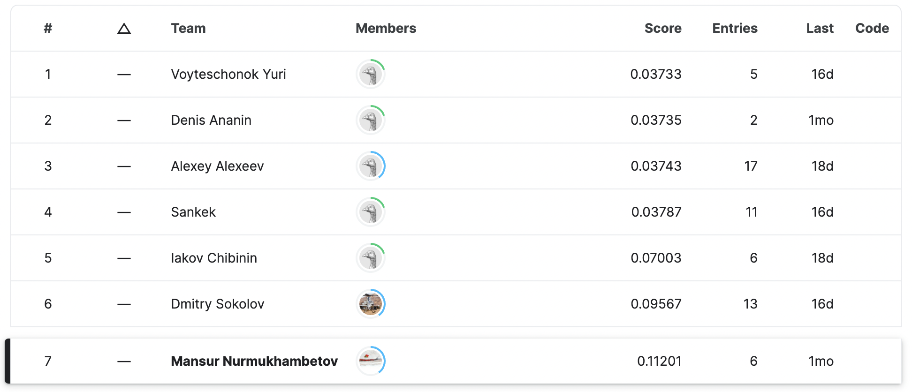

  

# Molecule energy RuCode 5.0

## Problem

### Description

The chemical and physical properties of a molecule are determined not only by the structural formula, but also by its three-dimensional realization. An important task in the search for possible three-dimensional realizations (conformations) of molecules is the estimation of their energies.

One proven approach for predicting conformational energies and other chemical and physical properties is the use of GNNs (Graphed Neural Networks) [[Schrödinger network](https://arxiv.org/abs/1706.08566), [Directional Message Passing for Molecular Graphs](https://arxiv.org/abs/2003.03123)].

In this competition, you need to learn how to predict energy from a three-dimensional representation of a molecule. You will be given a set of conformations for a subsample of molecules from the [MOSES](https://github.com/molecularsets/moses) dataset. For some of the conformations, the energy value will also be given.

### Evaluation

Evaluation metric – [MAE](https://en.wikipedia.org/wiki/Mean_absolute_error).

### My solution

You can listen to my solution on the [livestream](https://www.youtube.com/watch?v=jGRQjQZg4Ck&t=8577s) (only in russian).

**[WIP]**

  

## Leaderboard

Results of the competition can be watched on the [livestream](https://www.youtube.com/watch?v=jGRQjQZg4Ck&t=11308s) (only in russian).

<a href="https://www.kaggle.com/competitions/molecular-energy-estimation-rucode/leaderboard">
  
  ![Kaggle Badge][kaggle-badge]

  

      
  

</a>

## License
All of the codebase is **MIT Licensed** unless otherwise stated.

[kaggle-badge]: https://img.shields.io/badge/kaggle-leaderboard-blue?logo=data:image/png;base64,iVBORw0KGgoAAAANSUhEUgAAADAAAAAwCAYAAABXAvmHAAAAAXNSR0IArs4c6QAAAzNJREFUaEPtmktrE1EUgL8ziQqCL9qFImgi6kbBhV2KNY+2thtdiC4UFV8griru3LjwB7iqqOjC+loIorhQaBO0vvCFiCBI2iT1rRWxIFjT3iOpxUUz0Ux6Z2whd31n5vvOOXPuvZMIU3zIFOfHk8DytNYXlHZVQn/EBRMKcby3UV7/j2B4EoiktAW4MR5UYWs+LhemroCwLR+T8zWBKiJgp4RqGagi9GOX1DJQDITWSqhWQpVFoOxCViuhygLoNqvWhWpdqPrqGb0y8BKKduteIxwSCJewC9dyMWn34hSoQBFe4QRSGjiFbxha80m5PykFomndo4aTbvAoXwXWZxPy0At8YCW0OKW7BE4Bjsth6JNjaMom5blX+EAE/gaP8iHk0NQbkxfVwPsuEEnrTpTTZSLfHxYSvTHJVAvvq0AkrTtQzrjBo+SMkuhPSt9E4H0TiKR1ixrOiZS2SoVX04REJiZvJgrvi0A0pZuNct4NHuXlyAjJ183yzga8dYFoWjcZw0VXeMOz8HSaM2vlsy14qwIODJWFhycFQ8vbpHyxCW9PQLkMbHSLvCh3Q0O0Zdpk0Da8NYFyYKoMi8OyXExyfsD7LjC61YY79bOJP2mQgh8SVjZz/wQTjnndZf7znmMTghH4nYnd+bgUFzarw6qAMVx1HJYCK0oolR+OsrYvKY9sGtgTUC7VzWH71+9EzDAPEeaWgBrejxgaJt9CBp352+zkiJgidCSlG1CuuO79hZ66WSRsvdRWMuD2aTHarUdVOOxWLmLoyCblgI1S8k2AI+pEGrmO0uoqoezLJqR4yJnQ8E8AWNSj85wCj4El4ylVKThKIpuUnokY+CpQBIumdJXCPWCmS2f6MAwNbxLytloJ3wVGJdK6TZVOV0jDg/BP1mXaZKgaiUAExjpTB7C/DOTZXFx2TGqB1Y912sAgKYE1bqAKB/JxKUp6GoFlYDQLaZ3PCE9xWOD2UovQlIvLLS8GngSi3dqsws2Sh3v4oTuS0kZVusqclz/OEFa+islApRKeBBZ2ad10h4Pj/2oQFjq8HNIXd2urQKMbpGPo6GuSfl8EKr1pkPM8ZSBIsEqf9QucsNtAONWukwAAAABJRU5ErkJggg==
