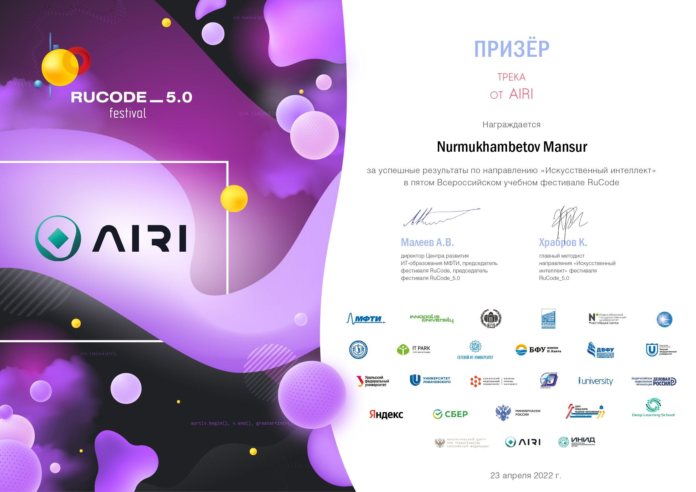

# Molecule Energy Estimator


Predicting molecular energies from 3D conformations using neural networks. Built for the RuCode 5.0 hackathon.

## What's this about

The chemical and physical properties of a molecule depend not just on its structural formula but on its conformation — where atoms sit in 3D space. Estimating molecular energies is important, but methods like DFT are computationally expensive. This project uses neural networks to do it faster.

The problem and data came from the [Artificial Intelligence Research Institute](https://airi.net/) as part of [RuCode 5.0](https://rucode.net/), using molecules from the [MOSES](https://github.com/molecularsets/moses) dataset.

### The approach

1. Assume kinetic energy is zero (no movement data). Focus on potential energy as the sum of bond energies.
2. For each pair of atoms, check if a bond exists based on distance.
3. Count bond types and feed them into a neural network that learns bond energies.

This got **7th place** in the competition. You can hear the solution explained on the [livestream](https://www.youtube.com/watch?v=jGRQjQZg4Ck&t=8577s) (in Russian).

Work continued in a [separate repo](https://github.com/nomomon/molecule-energy-prediction) with a deeper dive — turns out bond energy isn't constant, it has discrete energy levels. Used a constraint satisfaction solver to determine them, which improved results. Full [research report here](https://nomomon.github.io/molecule-energy-prediction/report/report.pdf).

## How to launch

```bash
jupyter notebook "rucode_5_(Molecule).ipynb"
```

Or open in [Google Colab](https://colab.research.google.com/).

## Achievements

<p align="center">
  
  
  
  
</p>

## Leaderboard

[](https://www.kaggle.com/competitions/molecular-energy-estimation-rucode/leaderboard)

## Story

This started as a hackathon entry and turned into actual research. The RuCode 5.0 experience was one of the things that got me into ML competitions — it directly inspired me to later organize the [Groningen Machine Learning Month](https://nomomon.github.io/posts/2022-12-20-gmlm/) at my university.
